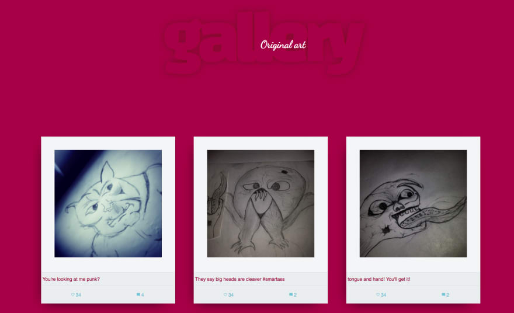
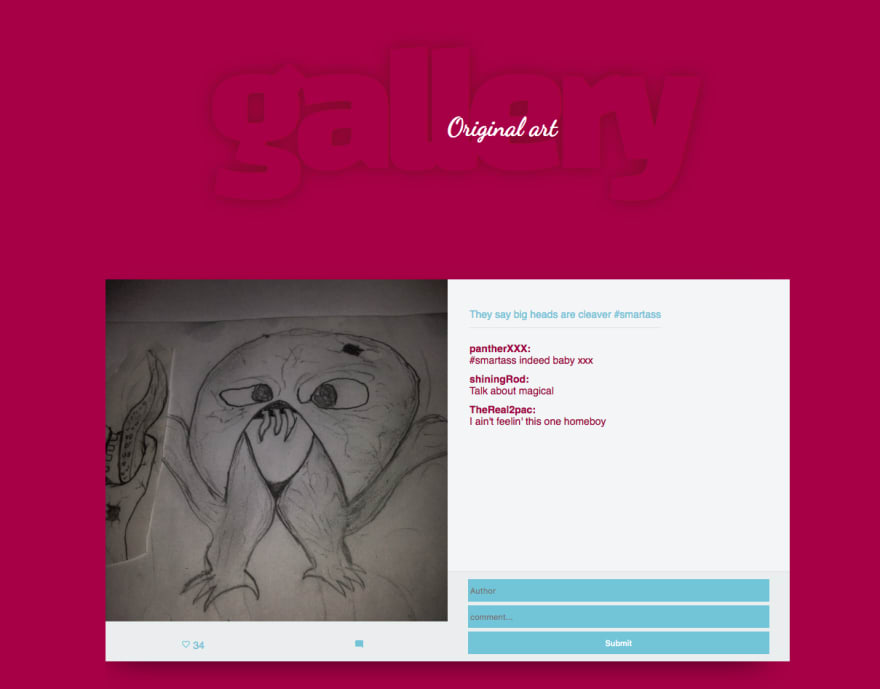

#### About the project

This repository is dedicated to exploring next.js. Each branch corresponds to a tutorial I have writen and the master branch will always have code from the latest tutorial.

#### Setup 

```sh
npm install # install dependencies
npm run api # run json-server
npm start # run next.js
```

#### Tutorials so far:

- [Introduction to the basics of Next.js](https://dev.to/aurelkurtula/introduction-to-the-basics-of-nextjs-1loa) - branch : [part1](https://github.com/aurelkurtula/basics-of-nextJS/tree/part1)
- [Retrieving data from an external API](https://dev.to/aurelkurtula/introduction-to-the-basics-of-nextjs---part-two-pad)


To illustrate the features I have decided to create a prototype that resembles instagram 

Home page: 



Photo page:

